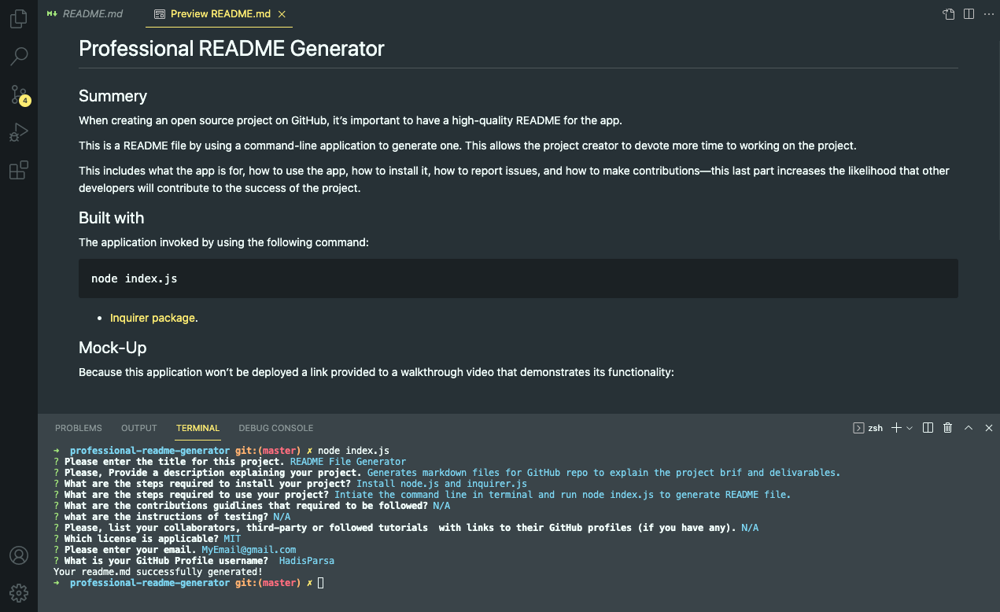

# <README-File-Generator>

# README File Generator

## Summery 
When creating an open source project on GitHub, it’s important to have a high-quality README for the app. This project include what the app is for, how to use the app, how to install it, how to report issues, and how to make contributions&mdash;this last part increases the likelihood that other developers will contribute to the success of the project.

You can quickly and easily create a README file by using a command-line application to generate one. This allows the project creator to devote more time to working on the project.

## Built with

command-line application that dynamically generates a professional README .md file from a user's input using the [Inquirer package](https://www.npmjs.com/package/inquirer). 

The application will be invoked by using the following command:

```bash
node index.js
```

## Demo

 A walkthrough video that demonstrates the functionality of the README generator

 


link to the video:
 [https://watch.screencastify.com/v/sESdtP067M0kybK7y4ih](https://watch.screencastify.com/v/sESdtP067M0kybK7y4ih) 


## Mock-Up

The following images show appearance and functionality:




